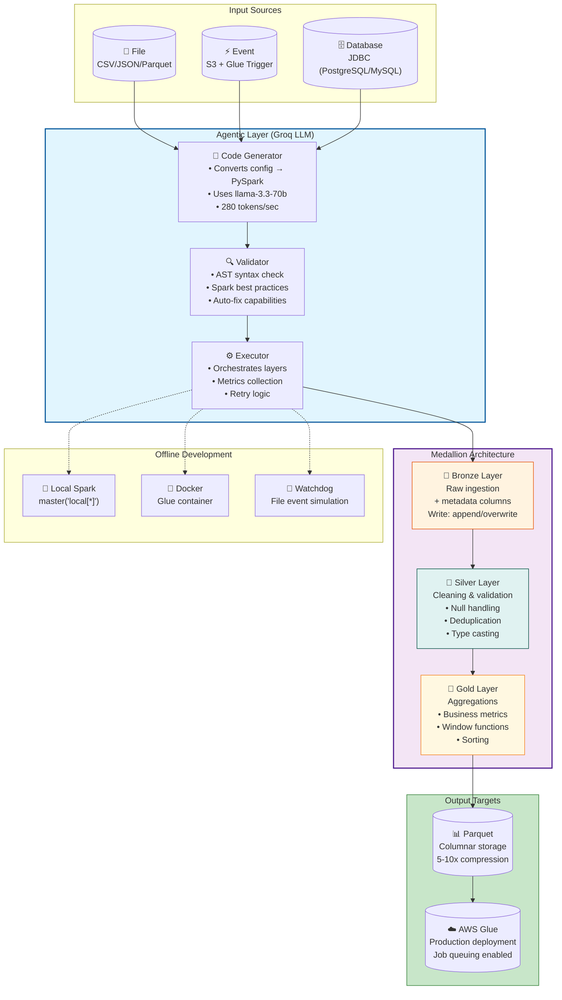

# Agentic Glue ETL Pipeline

Config-driven ETL pipeline using Groq LLM and PySpark for medallion architecture (Bronze → Silver → Gold).


## Description

This repository delivers a config-driven ETL pipeline that leverages Groq's LLM to auto-generate PySpark code for medallion architecture (Bronze → Silver → Gold). 

It supports offline development with local Spark and production deployment on AWS Glue with built-in job queuing and S3 event triggers. 

The pipeline handles three input sources (batch files, event-triggered files, and database queries) and outputs to Parquet configurable for both local and AWS environments via a single USE_CASE_CONFIG dictionary. 

Switch domains (IoT, Fintech, Web Logs) or ingestion patterns without changing pipeline logic, making it ideal for LLM-powered data engineering with zero infrastructure lock-in.


# Quick Start
## Setup
```python
python -m venv .venv
source .venv/bin/activate
pip install -r requirements.txt
```

# Configure
cp .env.example .env
#### Edit .env with your GROQ_API_KEY

 - Run
```python
python scripts/run_pipeline.py
```
# Architecture


Config (USE_CASE_CONFIG)\
then\
 → Code Generator → PySpark Code → Validator → Executor → Bronze/Silver/Gold

# Directory Structure
```bash
├── agents/               # CodeGenerator, Validator, Executor
├── config/               # Settings and configuration
├── data/                 # Data lake (raw/bronze/silver/gold)
├── notebooks/            # Jupyter notebooks for development
├── scripts/              # run_pipeline.py, file_monitor.py
├── output/               # Generated code and logs
└── tests/                # Unit tests
```

## Configuration

Modify \`USE_CASE_CONFIG\` in \`agents/code_generator_agent.py\`:

```json
USE_CASE_CONFIG = {
    "business_domain": "Your Domain",
    "source": {"type": "file", "environment": "offline"},
    "cleaning_rules": {...},
    "aggregations": {...},
}
``` 
# Usage

## Run complete pipeline
```bash
python scripts/run_pipeline.py
```
# Run specific layer
```bash
python scripts/run_pipeline.py --bronze
```

# With input file (event source)
```bash
python scripts/run_pipeline.py --input data/raw/file.csv
```

# File monitoring (event simulation)
```bash
python scripts/file_monitor.py
```
 - Then copy the files one at a time and they will get processed sequentially (as in a queue)
# Layers

- **Bronze**: Raw ingestion with metadata columns
- **Silver**: Data cleaning, validation, deduplication
- **Gold**: Aggregations and business metrics

## Output Formats

- **Parquet** (default) - Local development

## Switching Domains

Create new config (examples) for IoT, Fintech, Web Logs, Heathcare, etc.:
```python
agent = CodeGeneratorAgent(use_case_overrides=USE_CASE_CONFIG_IOT)
```

## License

MIT
